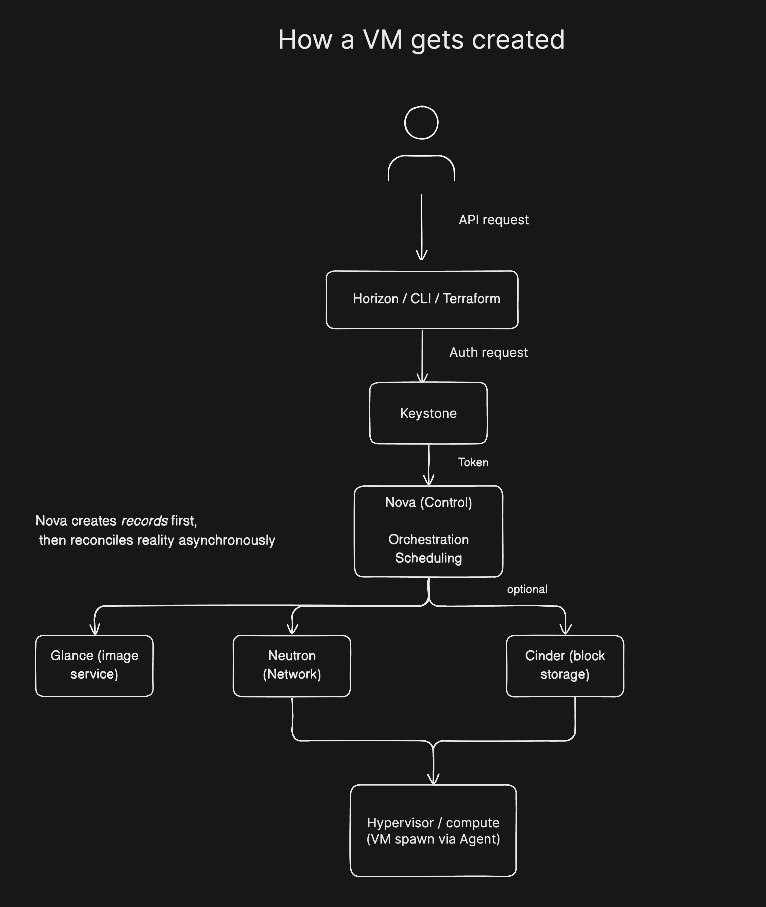
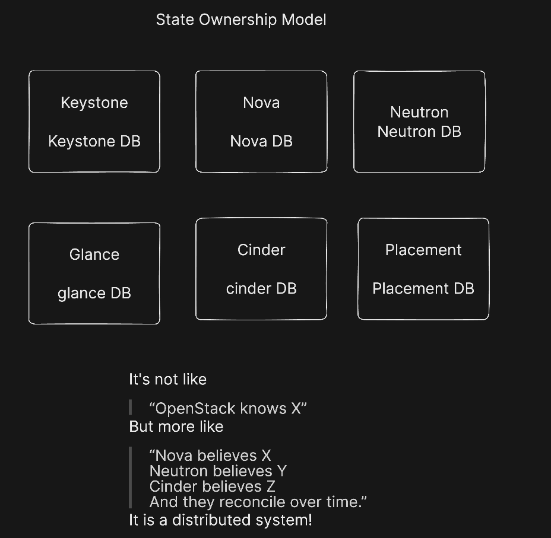

# OpenStack to Kubernetes Pipeline

Because clicking buttons in Horizon gets old fast.

---

## Week 1: DevStack Installation (local.conf)

The **local.conf** file is used to automate OpenStack installation using DevStack, a development setup script.

### Setup

1. Copy the template file:
```bash
cp local.conf.example local.conf
```

2. Edit `local.conf` and set your own passwords:
```bash
nano local.conf
```

3. Run DevStack with this config file to deploy OpenStack.

### Configuration

The `local.conf` file contains:
- **Passwords** - Credentials for OpenStack services (keep these private!)
- **Network** - Automatically detects your host IP
- **Logging** - Configures log file location and retention
- **Reclone** - Set to `no` to skip re-cloning during updates

⚠️ **Important:** `local.conf` is in `.gitignore` - never commit actual passwords to version control.

---

## OpenStack Architecture

### VM Creation Flow



This diagram shows how a virtual machine is created in OpenStack:
1. **Horizon** - Web dashboard receives the request
2. **Keystone** - Authenticates the user
3. **Nova** - Processes the compute request
4. **Hypervisor** - Executes the VM creation

### Service Architecture



OpenStack follows a modular architecture where:
- Each service (Keystone, Nova, Neutron, etc.) has its own database
- Each service manages its own state independently
- Services communicate via APIs and message queues
- This ensures fault isolation and scalability

---

## Week 2: Automating the Infrastructure

### Part 1: Manual Kubernetes Install

Followed "Kubernetes The Hard Way" to understand what actually happens under the hood. With Terraform, I set up a 3-node cluster (1 control plane, 2 workers) on OpenStack VMs.

Learned about certificates, kubeconfig files, etcd, and why networking is always the hard part.

### Part 2: Terraform All The Things

Expanded my terraform so that the VMs are 100% for Ansible to take it from there (they can communicate with each other on the private network, and I can SSH into them from the jumpbox [floating IPs are already generated and attached]).

**File structure:**
```
├── providers.tf        
├── variables.tf        
├── data.tf             
├── compute.tf          
├── network.tf          
├── outputs.tf         
├── ansible.tf          
├── terraform.tfvars    
└── ansible/            # Next: automate K8s install (work in progress)
```

**What it does:**
- Spins up 3 Debian 12 VMs (m1.small, 2GB RAM each)
- Creates security groups so nodes can actually talk to each other (on all protocols, not just ping)
- Assigns floating IPs for SSH access
- Generates an Ansible inventory file automatically

**The security group gotcha:**
Initially nodes could ping each other but TCP was blocked. Fixed by creating a `k8s_internal` security group with `remote_group_id` pointing to itself. Basically "trust anything in this group."

Validated with a quick test script - all nodes can now communicate properly.

### Usage

Source credentials first (always forget this):
```bash
source /opt/stack/devstack/openrc admin admin
```

Then the usual Terraform dance:
```bash
terraform init
terraform plan
terraform apply
```

Terraform generates `inventory.ini` automatically with all the node IPs. Ready for Ansible.

### Next: Ansible Playbooks

Currently writing Ansible to handle the cluster setup.

---

## What Changed from the Simple Version

The old setup was a single TF file. New version:
- Split into proper modules (providers, compute, network, etc.)
- Multi-node cluster instead of one VM
- Actual networking (security groups, floating IPs)
- Auto-generated Ansible inventory
- Variables for everything (image, flavor, cluster name)

---

## Requirements

- OpenStack (DevStack in my case)
- Terraform >= 0.14.0
- OpenStack credentials sourced
- SSH keypair configured (`key_pair_name` variable)

---

## Files

**Week 1:**
- `local.conf` / `local.conf.example` - DevStack config
- `first_pic.png` / `second_pic.png` - Architecture diagrams

**Week 2:**
- `*.tf` files - Terraform infrastructure
- `terraform.tfvars` - Config values
- `ansible/` - K8s automation (WIP)
