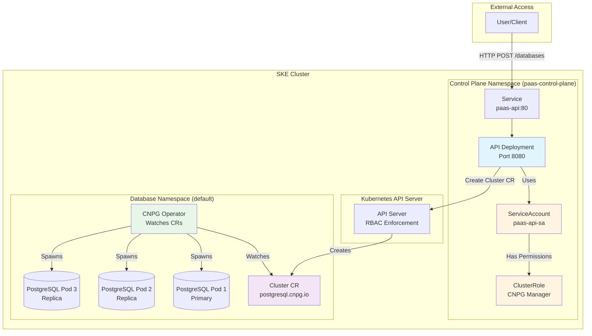
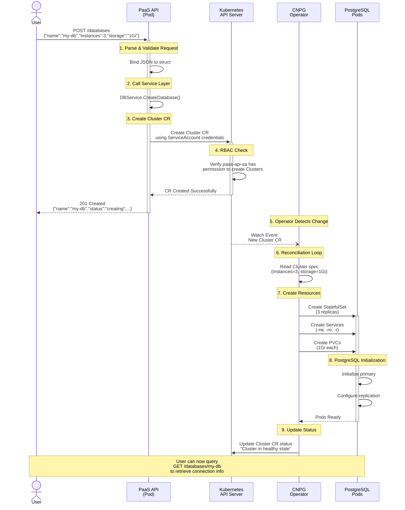
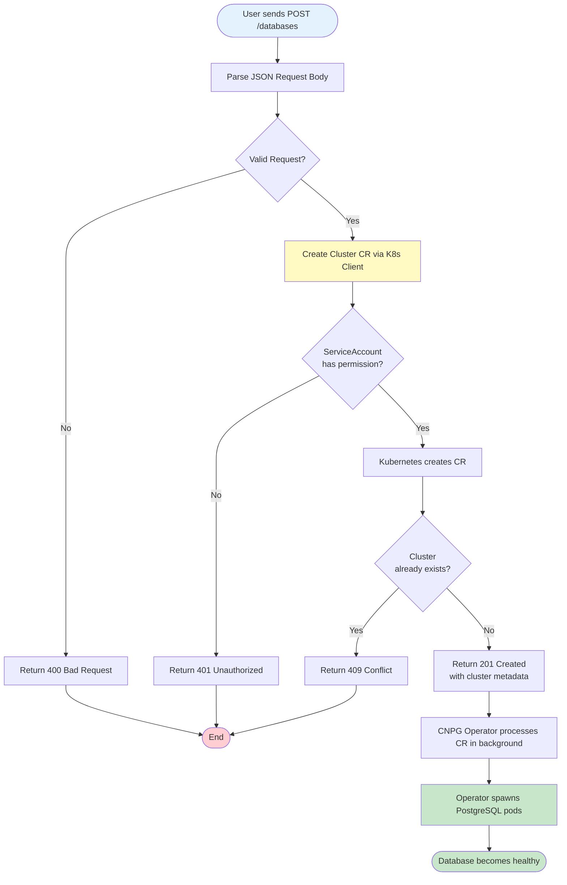

# PaaS Database Platform - Architecture & Flow Diagrams

## 1. System Architecture (Week 4)

## 2. Database Creation Flow (Sequence Diagram)

## 3. Create Flow (Simplified Flowchart)

## 4. Key Endpoints and Their Flow

### POST /databases
1. User → Service → API Pod
2. API validates request body
3. API creates Cluster CR in Kubernetes
4. Returns 201 with metadata
5. CNPG Operator asynchronously provisions pods

### GET /databases
1. User → Service → API Pod
2. API lists all Cluster CRs
3. Returns array of database summaries

### GET /databases/{name}
1. User → Service → API Pod
2. API fetches specific Cluster CR
3. Generates connection info
4. Returns database details + connection string

### DELETE /databases/{name}
1. User → Service → API Pod
2. API deletes Cluster CR
3. CNPG Operator tears down pods
4. Returns 204 No Content
